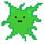
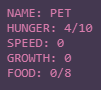

# PET

[DEMO](https://bennyboy.tech/petproject)

**PET** is a simple "toy simulation" in which you try to raise a pet using food. This is not meant to be a full-featured game, but rather more of a proof of concept. However, the game is fully playable and showcases a few ideas/mechanics I was experimenting with.

## Controls

- `Click + Drag` - move pet/food around
- `Q` - place food
- `W` - remove food

## How to Play

### Pet

This is the pet you will raise. There is no inherent goal that you are given with this pet, but if the pet's **hunger** drops to 0, then it will die. The pet loses 1 hunger every 4 seconds, and loses some more hunger when moving. The pet will actively seek out/follow food if it is able to move.

This pet will grow every 8 seconds if given enough food. Growth can happen in two areas: **speed** and **maximum hunger**. Speed lets the pet move faster, while **maximum hunger** allows the pet to stay alive without food for longer. The way that the pet decides how to grow is determined mainly by availability of food; try placing food at different distances from the pet to see how the pet reacts.

### Food

This is the pet's source of food. When in contact with food, the pet restores 1 unit of hunger per second. Each food can restore up to 5 hunger, each bread can be placed with a cooldown timer of 3 seconds, and a maximum of 8 pieces of food can be placed.

When the pet has completely eaten the food source, the above is what the food source will become. The pet cannot eat these depleted foods, but they will still take up precious food slots; it is your responsibility to clean them up!

### Statistics

When you start the game, the top-left corner of the screen will show a list of statistics related to the pet.

## Misc.

Made with love by Ben Pang as a midterm project for Intro to IM 2020. Licensed under the MIT License.
